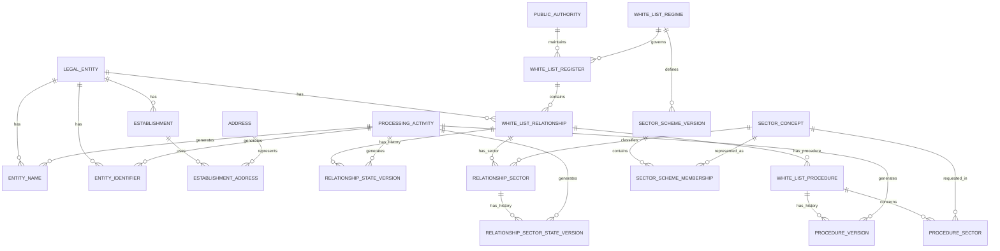
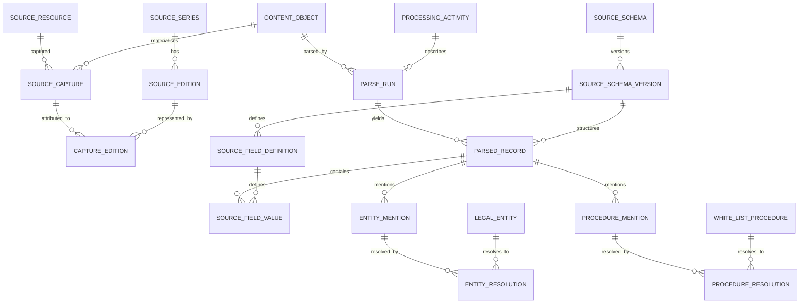

# ERD v0.2 — audited consolidated baseline

This document records the logical baseline implemented by the corrected pre-alpha PostgreSQL schema.

## Canonical core

## Source and provenance

`SourceFieldValue` carries the schema version explicitly and uses composite foreign keys so that the parsed record and field definition must belong to that same source-schema version.

## Key semantic decisions

- A White List relationship is unique for `legal_entity × register` and carries no status itself.
- Requested sectors are attached to procedures; sectors actually represented in the register are attached to the relationship.
- `I`, `II`, ..., `X` are not canonical sector identifiers. They are notations within a versioned scheme.
- Scheme versions for one regime cannot overlap; membership periods must be contained in their scheme-version period.
- A relationship-sector state may reference a scheme membership only when both its canonical sector and regime match the relationship/register context.
- Canonical historical versions carry `effective_period`, `observation_period`, and `system_period` where all three dimensions matter.
- Unknown `effective_period` remains semantically unknown, but is treated as an all-time wildcard when evaluating overlap integrity.
- Open system/observation periods use true unbounded range bounds (`NULL` bound), so `upper_inf()` correctly identifies current rows.
- A source locator is not assumed to be a web URL. Web URLs are optional metadata, supporting future FOIA/archive acquisitions.
- Immutable bytes are represented by `content_object` and keyed by SHA-256. Source field values are append-only.
- Parsing is versioned through `parse_run` + `processing_activity`; reprocessing the same content never destroys an earlier interpretation.
- Evidence is many-to-many and can point to a field value, parsed record, source edition, or source capture.
- Evidence and processing lineage are separate: evidence explains support; `ProcessingActivity` explains generation/transformation.
- Derived events retain explicit links to the canonical version rows used as inputs.
- Dissemination decisions are scoped to named publication profiles rather than attached globally to a field.
