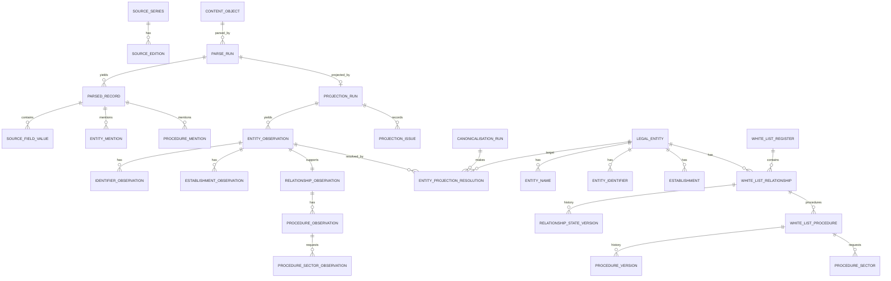

# ERD v0.3-dev — source → semantic → canonical pipeline

This document extends the audited v0.2 baseline with the 0.1.1 development semantic-projection layer. It does not retroactively change the frozen 0.1.0 release.

## End-to-end model



## Why the semantic layer exists

`source.*` records what a parser extracted. `core.*` / `whitelist.*` represent the canonical model. Direct parser → canonical writes would mix physical extraction assumptions with identity and administrative interpretation.

The `semantic.*` namespace is the typed, reviewable bridge:

- it is populated automatically after successful parsing;
- it preserves ambiguous/malformed source values;
- it records ontology mappings and projection issues;
- it allows safe canonical facts to be materialised without waiting for every edge case to be manually resolved;
- it keeps unresolved identity/procedure questions visible as first-class data.

## Parser-family routing

Parser implementations are not represented as database entities per URL. The data-driven registry under `data/source_registry/` provides:

```text
SourceSeries
   ↓ binding / schema fingerprint
ParserFamily
   ↓
RecordContract
   ↓
SemanticProfile / Projector
   ↓
semantic.*
```

Different physical parsers can share a record contract and semantic projector.

## Canonicalisation rule

Canonicalisation is a separate versioned processing activity. A `LegalEntity` or administrative fact is materialised only when the rule associated with the current resolver version supports it.

For the current Cosenza pilot:

- 2,661 entity observations are projected;
- 2,655 are automatically resolvable;
- 6 remain deliberately unresolved;
- ambiguous source identifiers never enter `core.entity_identifier` unless independently resolved;
- requested activities populate `procedure_sector`, not `relationship_sector`;
- listing dates that precede a later application remain relationship/source observations rather than false procedure decision dates.

## Population is dynamic

The physical existence of a table in this ERD does not imply that a source can populate it. The Dataset Explorer consumes a database-generated population manifest so each object carries an actual count plus an operational status/reason.

Examples:

- `whitelist.relationship_sector = 0 / NOT_APPLICABLE_FROM_CURRENT_SOURCE` for the current Cosenza combined-list source;
- `derived.derived_event = 0 / NOT_YET_PROCESSED` until longitudinal canonical history is explicitly derived.
